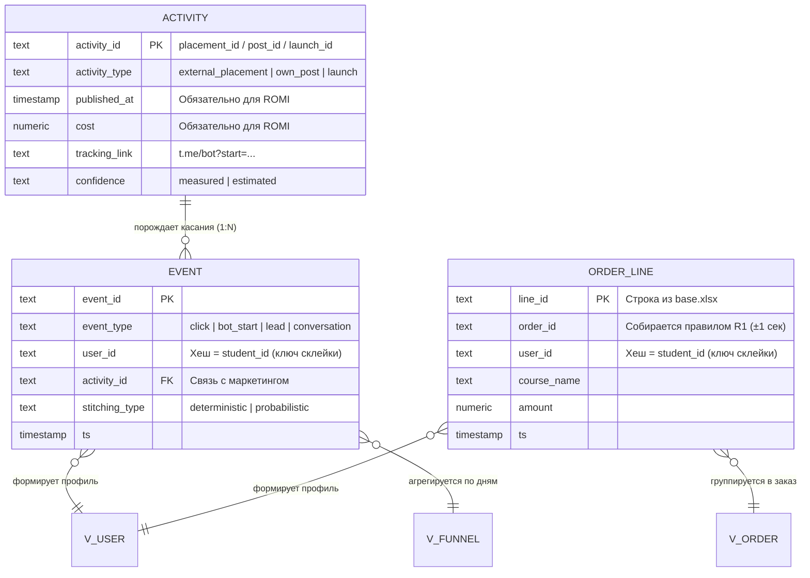

## 1. База данных и диаграмма
### 1.1 SQL код 3 таблиц + 3 view

```sql
CREATE TABLE activity (
  activity_id     TEXT PRIMARY KEY,
  activity_type   TEXT,        -- external_placement | own_post | discount | launch | price_change
  campaign_id     TEXT,
  campaign_name   TEXT,
  channel_name    TEXT,
  channel_type    TEXT,        -- external | own | null
  published_at    TIMESTAMP,   -- обязательно для ROMI
  ended_at        TIMESTAMP,
  cost            NUMERIC,     -- 0 для своих постов/промо; обязательно для ROMI
  post_type       TEXT,        -- sale|discount|native|content|launch
  promo_code      TEXT,
  discount_pct    NUMERIC,
  tracking_link   TEXT,        -- t.me/bot?start=<activity_id>
  creative_type   TEXT,        -- post|video|story
  source_of_truth TEXT,        -- ad_registry|ops_calendar|reconstructed_tgstat|manual
  confidence      TEXT         -- measured|estimated
);

-- ============================================
-- TABLE 2. event — единый журнал событий пользователя
-- ============================================
CREATE TABLE event (
  event_id        TEXT PRIMARY KEY,
  event_type      TEXT,        -- click | bot_start | channel_join | lead | conversation_started
  user_id         TEXT,        -- хеш = student_id (ключ стыковки с base.xlsx)
  ts              TIMESTAMP,
  activity_id     TEXT REFERENCES activity,  -- null => organic/unknown
  stitching_type  TEXT,        -- deterministic | probabilistic | unknown
  tracking_code   TEXT,        -- сырой ?start=
  manager_id      TEXT,
  declared_source TEXT,        -- ответ «откуда узнали»
  interest_course TEXT,
  source_of_truth TEXT         -- bot | manager_bot | crm_manual
);

-- ============================================
-- TABLE 3. order_line — факт продаж (зерно base.xlsx)
-- ============================================
CREATE TABLE order_line (
  line_id         TEXT PRIMARY KEY,
  order_id        TEXT,        -- собирается правилом R1: user_id + ts ±1 сек
  user_id         TEXT,        -- = student_id
  course_name     TEXT,
  amount          NUMERIC,     -- доля заказа
  ts              TIMESTAMP,   -- = оплата = выдача доступа
  order_type      TEXT,        -- single | package | anomaly_review
  is_repeat       BOOLEAN,
  payment_status  TEXT         -- success
);

-- ============================================
-- VIEWs (производные, не хранятся)
-- ============================================
CREATE VIEW v_order AS
  SELECT order_id,
         user_id,
         MIN(ts)  AS ts,
         SUM(amount) AS total,
         STRING_AGG(course_name, ', ' ORDER BY course_name) AS courses,
         MAX(order_type) AS order_type,
         BOOL_OR(is_repeat)  AS is_repeat
  FROM order_line
  GROUP BY order_id, user_id;

CREATE VIEW v_user AS
  SELECT 
    e.user_id,
    MIN(e.ts) AS first_seen_at,
    (SELECT activity_id FROM event e2
     WHERE e2.user_id = e.user_id ORDER BY ts LIMIT 1) AS first_activity_id,
    COUNT(DISTINCT o.order_id) AS total_orders,
    COALESCE(SUM(o.total), 0) AS total_revenue,
    COUNT(DISTINCT o.order_id) > 1 AS is_repeat_buyer
  FROM event e
  LEFT JOIN v_order o ON e.user_id = o.user_id
  GROUP BY e.user_id;
  
CREATE VIEW v_funnel AS
        SELECT DATE(ts) AS day,
               COUNT(*) AS transactions,
               COUNT(DISTINCT order_id) AS orders,
               SUM(amount) AS revenue
        FROM order_line
        GROUP BY DATE(ts);
```

## 1.2 Диаграмма

---

## 2. Event-контракт (tracking plan)

### Группа A. События пользователя → `event` *(появятся завтра)*

| # | event_type | КТО | ЧТО | КОГДА | ОТКУДА | К КАКОЙ АКТИВНОСТИ | Как собираем | Наблюдаемость |
|---|---|---|---|---|---|---|---|---|
| 1 | `click` | user_id | клик по трекинг-ссылке | ts | tracking_link | activity_id | бот парсит `?start=` | future, measured |
| 2 | `bot_start` | user_id | старт бота с метками | ts | `?start=<activity_id>` | activity_id | Telegram Bot API | future, measured |
| 3 | `channel_join` | user_id | подписка на основной канал | ts | бот-приветствие | activity_id первого касания | бот | future, measured |
| 4 | `lead` | user_id | «написать менеджеру» | ts | кнопка поста/бота | activity_id поста | бот | future, measured |
| 5 | `conversation_started` | user_id + manager_id | начало диалога | ts | manager-bot / CRM | activity_id из lead | manager-bot | future (переписку НЕ храним) |

### Группа B. События продаж → `order_line` / `v_order` *(есть исторически)*

| # | Событие | КТО | ЧТО | КОГДА | ОТКУДА | К КАКОЙ АКТИВНОСТИ | Как собираем | Наблюдаемость |
|---|---|---|---|---|---|---|---|---|
| 6 | `order_created` | user_id | заказ (1..N курсов) | ts | — | через attribution | base.xlsx (правила R1–R4) | **сейчас** |
| 7 | `payment_success` | user_id | оплата прошла | ts | платёжка | — | base.xlsx.amount | **сейчас** |
| 8 | `access_granted` | user_id | доступ в чат курса | ts | — | — | base.xlsx | **сейчас** (слито с payment) |

### Группа C. Логи активностей → `activity` *(не user-level)*

| # | Событие | КТО | ЧТО | КОГДА | ОТКУДА | Как собираем | Наблюдаемость |
|---|---|---|---|---|---|---|---|
| 9 | `placement_published` | маркетолог | размещение вышло | published_at, cost | ad registry | реестр размещений | future + reconstructed |
| 10 | `post_published` | редактор | пост в своём канале | published_at | ops calendar | календарь запусков | future |
| 11 | `promo_start` / `launch_start` | продакт | старт скидки / запуска | published_at..ended_at | ops calendar | календарь | future (следы — в base.xlsx) |

### Группа D. События, которые НЕ создаём *(честный уровень «нельзя»)*

| # | Событие | Почему не логируем | Чем заменяем |
|---|---|---|---|
| 12 | `post_view` (просмотр своего канала) | нет внутренних Insights | прокси: `channel_join`, `bot_start` после поста |
| 13 | `ad_view` (просмотр внешнего размещения) | нет данных о просмотрах | опционально `event` с `confidence='estimated'` из TGStat |
| 14 | `message_content` (содержание переписки) | нельзя хранить ПДн | только факт `conversation_started` + `declared_source` |

**Итого:** 11 логируемых типов событий + 3 запрещённых.

---

## 3. Матрица наблюдаемости (3 уровня знания, слайд 25)

| Уровень | Что | Где в модели |
|---|---|---|
| **ЗНАЕМ** | 795 транзакций, 693 заказа, 606 юзеров, выручка 5.9M, ARPU 9 800 ₽, 11% repeat | `order_line` + `v_order` + `v_user` |
| **ОЦЕНИВАЕМ** | Даты запусков (8–9.08, 22–23.08, 5–6.09), пакеты, волны цен | `activity` с `confidence='estimated'` |
| **ПОКА НЕЛЬЗЯ** | Касания до оплаты, cost размещений, просмотры постов, переписки | появится после внедрения `event` + `activity.cost` |

---

## 4. Правила сборки данных и Assumptions (защищаемые гипотезы)

### 4.1. Правила сборки заказов (Data Assembly Rules)

_Как мы превращаем 795 строк `base.xlsx` в витрину `v_order` (693 заказа)._

| Правило                                   | Логика (SQL/Pandas)                                                                                                                                    | Обоснование (из EDA и условия кейса)                                                                                                                        |
| ----------------------------------------- | ------------------------------------------------------------------------------------------------------------------------------------------------------ | ----------------------------------------------------------------------------------------------------------------------------------------------------------- |
| **R1. Пакетная покупка (Один заказ)**     | Строки с одинаковым `user_id` и `timestamp` (разница ≤ 1 секунды) получают один `order_id`.                                                            | В условии сказано: «иногда два курса продавались пакетом за 9 990 ₽». В данных это выглядит как две строки с одинаковым временем (например, 4 995 + 4 995). |
| **R2. Повторная покупка (Разные заказы)** | Тот же `user_id`, но `timestamp`отличается (например, через 30 минут или на следующий день) → генерируется новый `order_id`, флаг `is_repeat = TRUE`.  | Студент мог купить один курс, посоветоваться с родителями и вернуться докупить второй. Это две разные транзакции, а не пакет.                               |
| **R3. Выручка заказа**                    | `v_order.total` = `SUM(amount)`по `order_id`.                                                                                                          | `amount` в исходнике — это стоимость конкретного курса (или доли пакета), а не всего чека.                                                                  |
| **R4. Обработка аномалий**                | Заказы с экстремальными скидками (например, 4 курса за 8 950 ₽ вместо 27 800 ₽) **не удаляются**, а помечаются флагом `order_type = 'anomaly_review'`. | Мы не имеем права молча удалять данные. Это может быть как ошибка менеджера, так и легитимная супер-акция, которую нужно учесть при расчёте маржи (ROMI).   |

### 4.2. Бизнес-допущения (Assumptions)

|#|Assumption|Обоснование / Риск|
|---|---|---|
|**A1**|`user_id` в нашей модели = `student_id` из `base.xlsx`. Функция хеширования Telegram username, которую использует бизнес, остаётся неизменной.|**Критично для Задачи 4 (Склейка).**Если бизнес поменяет соль или алгоритм хеша, мы не сможем связать исторические продажи с новыми касаниями в боте.|
|**A2**|`timestamp` в `base.xlsx` = момент оплаты = момент выдачи доступа.|Основано на слайде 6 условия кейса. В реальности может быть задержка, но для MVP и атрибуции мы принимаем их как единое событие `payment_success`.|
|**A3**|Окно зависит от типа активности: 7 дней для внешней рекламы, 30 дней для внутренней атрибуции и когортного LTV.|Внешний deep link обычно приводит к быстрому действию. Собственный канал допускает прогрев до запуска, дедлайна или старта потока.|
|**A4**|Стоимость собственных постов (`own_post`) и запусков (`launch`) в таблице `activity` принимается равной **0 ₽** (или учитывается только cost производства).|У них нет медиа-баджетов (cost), их «стоимость» — это время команды. Для ROMI это важно, чтобы не делить на ноль и не искажать окупаемость платных посевов.|
