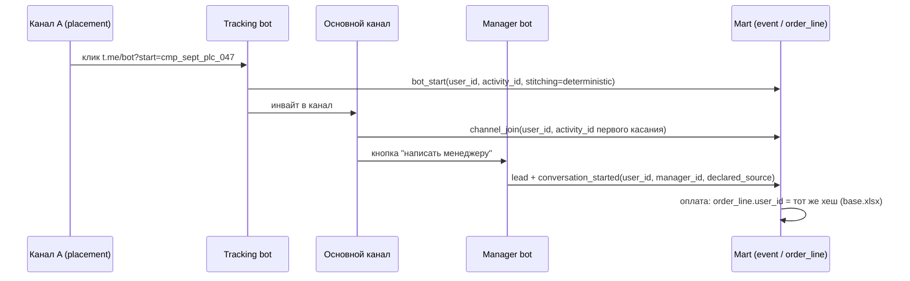

# Задача 4. User Stitching

## 1. Ограничения, определяющие решение
- Нет cookies и веб-пикселей: классический веб-трекинг в Telegram не работает.
- Нет доступа к перепискам менеджеров и внутренним Insights.
- Оплата происходит в личке с менеджером, вне бота.
- Персональные данные не хранятся — только необратимый хеш.

Решение: **один канонический ключ пронесён через все системы** + явная лестница fallback-правил там, где ключ теряется.

## 2. Канонический идентификатор
```
user_id = SHA-256(telegram_username + salt) = student_id из base.xlsx
```
- Совпадение с `student_id` обеспечивает стыковку будущих событий с историческими оплатами; функцию и соль даёт бизнес.
- Хранится только хеш: username, телефон, имя не логируются.
- Смена username и пользователи без username: при контакте с ботом фиксируются алиасы `hash(username)` и `hash(tg_id)`; связь восстанавливается через алиас, исторические оплаты не теряются.

## 3. Детерминированная склейка: цепочка из 5 хоппов

| # | Хопп | Ключ | Механизм |
|---|---|---|---|
| 1 | Клик по рекламе | `tracking_code` | ссылка размещения `t.me/bot?start=cmp_sept_plc_047` |
| 2 | Старт бота | `user_id` + `activity_id` | Bot API отдаёт username → тот же хеш, что и `student_id`; событие `bot_start` |
| 3 | Подписка на канал | `user_id` | `channel_join` наследует `activity_id` первого касания |
| 4 | Лид и диалог | `user_id` + `manager_id` | кнопка «написать менеджеру» через бота: `lead`, `conversation_started`, `declared_source` |
| 5 | Оплата | `user_id` = `student_id` | выдача доступа логирует payment тем же хешем |


**Мультитач:** пользователь может иметь N касаний за несколько дней. Склейка не выбирает «виновное» касание — все касания одного человека лежат под одним `user_id`, упорядочены по `ts`, каждое со своей `activity_id`. Распределение весов — задача атрибуции (Задача 6).

## 4. Когда детерминированная склейка невозможна: лестница приоритетов

| Приоритет | Метод | stitching_type | Достоверность | Условие |
|---|---|---|---|---|
| 1 | Трекинг-код / промокод | deterministic | measured | код распознан и есть в `activity` |
| 2 | Declared source («откуда узнали?») | declared | measured (self-report bias) | ответ получен, хранится категорией |
| 3 | Вероятностное окно W = 72 ч после публикации активности | probabilistic | estimated | в окне ровно одна кандидат-активность |
| 4 | unknown / organic | unknown | — | не атрибутируется |

Типовые потери ключа: видел рекламу, но не кликал → приоритет 3/4; подписался без deep link → 3; написал менеджеру напрямую → 2, иначе 4; оплата вручную вне бота → менеджер вносит хеш при выдаче доступа; ссылку переслали другу → источник приписывается кликнувшему (корректно). Уровни достоверности не смешиваются в одном отчёте: ROMI считается раздельно по срезам measured / estimated.

## 5. Историческая склейка
На уровне пользователя невозможна: касания до оплаты не логировались. Допустим только агрегатный уровень: пики продаж (8–9.08, 22–23.08, 5–6.09 из EDA) сопоставляются с датами публичных постов из TGStat и архивов → гипотеза связи с `confidence = 'estimated'`, только для бэктеста атрибуции, не как факт.

## 6. Место в модели данных
Поля таблицы `event`: `stitching_type` (deterministic | declared | probabilistic | unknown), `tracking_code`, `declared_source`, `activity_id` (null только при unknown/organic). Опционально — таблица `user_alias` (user_id, alias_type, alias_hash, first_seen_at).

## 7. Assumptions
| # | Предположение |
|---|---|
| S1 | Функция хеширования и соль идентичны генерации `student_id` |
| S2 | Трекинг-ссылка уникальна на размещение/креатив; персональные коды — фаза 2 |
| S3 | Окно W = 72 ч применяется только при единственной кандидат-активности |
| S4 | `declared_source` собирается с согласия, хранится категорией |
| S5 | Без username канонический ключ = hash(tg_id) с алиасной связкой |
| S6 | Историческая user-склейка невозможна; прошлое оценивается агрегатно |

## 8. Три уровня знания
| Уровень | Содержание |
|---|---|
| Знаем | Исторические оплаты с `student_id` (795 строк, 606 покупателей) |
| Оцениваем | Связь всплесков продаж с публичными активностями; вероятностная склейка контактов без метки |
| Пока нельзя | Касания до оплаты, просмотры постов, переписки — станут наблюдаемы после внедрения tracking bot, manager-bot и ad registry; поля под них уже зарезервированы в схеме |

**Вывод:** один необратимый ключ проносится от клика до оплаты; там, где ключ теряется, применяется лестница fallback-правил (declared → probabilistic → unknown) с маркировкой достоверности каждого события. Оценки не выдаются за факты.