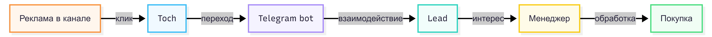

# Задача 5. Трекинг внешней рекламы

## Постановка
Завтра Поступашки покупают рекламу в 20 Telegram-каналах. Задача — 
спроектировать систему, которая позволит связать каждое размещение 
с конкретными покупками и посчитать ROMI по каналам.

## Что мы знаем
- 795 транзакций, 606 уникальных покупателей, 693 заказа (с учётом объединения пакетных покупок, совершённых в одну секунду)
- Общая выручка за период (04.08–10.09.2026) — 5 904 672 ₽
- Средний чек на транзакцию — 7 470 ₽, средний чек на заказ — 8 570 ₽, ARPU — 9 800 ₽
- Пакеты выгоднее для бизнеса: средний чек на заказ выше, чем на отдельную транзакцию (8 570 > 7 470)
- 89% покупателей купили 1 раз, 8% — 2 раза, ~3% — более 3 раз; ~11% покупателей — «лояльные» с LTV в 2-3 раза выше среднего
- Продажи идут волнами: пики 8-9 августа, 22-23 августа, 5-6 сентября совпадают с датами запуска новых потоков; в промежутках между запусками — заметные провалы
- Пики продаж приходятся на выходные и дневное/вечернее время (12:00 — поздний вечер), ночью почти нет покупок
- Топ-5 связок курсов в пакетах уже определены (готовые кандидаты для cross-sell после атрибуции)

## Что мы оцениваем
- Гипотетический ROMI по каждому placement — на основе mock-таблицы `ad_registry` (cost задан вручную как заглушка, т.к. реальных закупок рекламы ещё не было)
- Attributed Revenue считаем как «число атрибуцированных заказов × средний чек на заказ (8 570 ₽)» — упрощение, так как реальных сумм именно по атрибуцированным заказам в mock-сценарии нет
- Ожидаемое распределение эффективности между каналами — предполагаем, что оно неравномерно (по аналогии с тем, что реальные продажи концентрируются волнами вокруг запусков, а не равномерно) — то есть ROMI по каналам, скорее всего, тоже будет сильно отличаться в зависимости от того, попало ли размещение в «окно запуска»

## 1. Идентификаторы
- channel_id — сам Telegram-канал, где размещаем рекламу
- placement_id — конкретный пост/размещение в канале
- creative_id — вариант текста/картинки

Пример нейминга ID: `ch012_pl045_cr02` (канал 12, размещение 45, креатив 2)

## 2. Механизм трекинга
Deep link в Telegram-бота: `t.me/postupashki_bot?start=ch012_pl045_cr02`
Когда пользователь нажимает на эту ссылку из рекламного поста, бот получает `start=ch012_pl045_cr02` в самом первом сообщении

## 3. Схема данных
Как только пользователь запускает бота с этим параметром, записываем событие в таблицу `touches`:
### Таблица touches

| touch_id | student_id | channel_id | placement_id | creative_id | timestamp |
| --- | --- | --- | --- | --- | --- | 
| t001 | 415 | ch012 | pl045 | cr02 | 2026-09-12 14:03 |

### Таблица leads
Лидом считается пользователь, который после запуска бота нажал «Получить консультацию» или «Узнать стоимость» и передал контакт либо начал диалог с менеджером.

| lead_id | student_id | touch_id | lead_type | timestamp |
| --- | --- | --- | --- | --- | 
| l001 | 415 | t001 | consultation | 2026-09-12 14:03 |

### Таблица ad_registry
| channel_id | placement_id | creative_id | publication_time | cost |
| --- | --- | --- | --- | --- |
| ch012 | pl045 | cr02 | 2026-09-12 12:00 | 3000 |

## 4. Правило атрибуции
- Базовое окно для внешней рекламы: 7 дней
- Правило: last non-direct
- Обоснование: `Last Non-Direct` — более зрелая, правильная и защищаемая модель для EdTech. Она не позволяет "прямому трафику" (когда человек просто открывает сохраненную ссылку на бота) красть славу у платных размещений.

## 5. Обработка "неопределённых" пользователей
Если touch отсутствует — self_reported_source от менеджера, 
маркируется как organic/unknown, не притягивается к рекламе.

## 6. Расчёт ROMI
ROMI = (Attributed Revenue − Cost) / Cost * 100%

Пример (mock-данные, cost условный, т.к. реальных закупок рекламы ещё не было):

| placement_id | channel_id | Атрибуцированных заказов | Attributed Revenue | Cost | ROMI |
|---|---|---|---|---|---|
| pl001 | ch003 | 5 | 5 × 8 570 = 42 850 ₽ | 5 000 ₽ | (42 850 − 5 000) / 5 000 × 100% = **757%** |
| pl002 | ch007 | 2 | 2 × 8 570 = 17 140 ₽ | 6 000 ₽ | (17 140 − 6 000) / 6 000 × 100% = **186%** |
| pl003 | ch012 | 1 | 1 × 8 570 = 8 570 ₽ | 4 500 ₽ | (8 570 − 4 500) / 4 500 × 100% = **90%** |

За Attributed Revenue на заказ берём средний чек на заказ из EDA — **8 570 ₽** (а не средний чек на транзакцию 7 470 ₽, так как пакетные покупки на входе с рекламы логичнее считать заказом целиком, а не разбивать на отдельные курсы).

Вывод по примеру: `pl001` — явный лидер по ROMI, туда стоит перераспределять бюджет; `pl003` тоже прибылен, но заметно слабее — кандидат на пересмотр креатива или отключение.

## 7. Собственный канал: классификация постов

Классификация публикаций:
| Тип | Признак | Пример |
|---|---|---|
| sale | прямой призыв купить, цена, ссылка на оплату | "Разбор экзамена на стажировку в Т-банк за подписку!" |
| discount | упоминание скидки/промокода | "Скидка 20% по промокоду AI20" |
| native | интеграция с другим автором/каналом | "Партнёрский пост от @channel_x" |
| content | образовательный контент без продажи | "Как хакнуть HR" |

Логирование: таблица `channel_posts`
| post_id | post_date | post_type | course_mentioned | discount_pct | link_clicks |
|---|---|---|---|---|---|